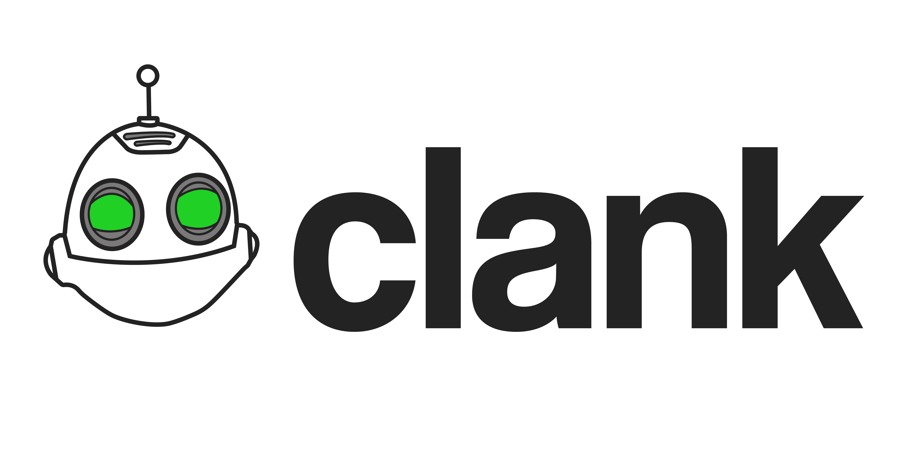

Clank is a high-performance and Open Source implementation of the
proprietary SCE-RT Medius server stack used in many PlayStation 2
and PlayStation 3 multiplayer titles. The project was originally
intended for *Ratchet & Clank: Up Your Arsenal* for the
[UYA Online](https://uyaonline.com/) project. However we decided
to redesign it to work with many other Medius titles as well.

Our server aims to be feature rich, modular, stable, and **fast**.

Currently this server supports emulating Medius v1.5 - v1.8, however we plan on
adding support for Medius v1.9 and v1.10 (2.10) soon.

Join our [R&C Online Discord community](https://discord.gg/mUQzqGu) for more information.

   

## Supported Games
The table below shows game titles that have been tested with Clank.
The focus of the table below is based on a title's ability to get from login to getting in a game world.
- **SUCCESS** = Able to get past MAS into MLS, create a game world on DME(P2S2P) or MAS(P2P) and be active in the game world.
- **PARTIAL** = Able to get past MAS into MLS.
- **INCOMPLETE** = Missing components or planned features to get past MAS.
- **UNKNOWN** = The title cannot be tested at the moment. See the description column for more info.

| Name                                                        | Status     | Notes                                                |
|-------------------------------------------------------------|------------|------------------------------------------------------|
| Amplitude NTSC-U (2003)                                     | PARTIAL    | Lobby mostly works, MAS is missing P2P.              |
| Jak X: Combat Racing NTSC-U (2005)                          | INCOMPLETE | Missing native MUIS component.                       |
| Jak X: Combat Racing PAL (2005)                             | INCOMPLETE | Missing native MUIS component.                       |
| Killzone NTSC-U (2004)                                      | SUCCESS    | Missing native MUIS component.                       |
| Ratchet & Clank: Up Your Arsenal NTSC-U USA (2004)          | SUCCESS    |                                                      |
| Ratchet & Clank: Up Your Arsenal PAL (2004)                 | SUCCESS    |                                                      |
| Ratchet & Clank: Up Your Arsenal NTSC-K Korean (2004)       | SUCCESS    |                                                      |
| Ratchet & Clank: Up Your Arsenal NTSC-U Public Beta (2004)  | PARTIAL    | Malformed payload for `CreateGame1`.                 |
| Ratchet & Clank: Up Your Arsenal NTSC-U Prototype (2004)    | PARTIAL    | Malformed payload for `JoinGame`.                    |
| Ratchet: Deadlocked NTSC-U (2005)                           | INCOMPLETE | Missing native MUIS component.                       |
| Ratchet: Deadlocked PAL (2005)                              | INCOMPLETE | New Central Station findings.                        |
| Syphon Filter: The Omega Strain NTSC-U (2004)               | PARTIAL    | Lobby mostly works, MAS is missing P2P.              |

## Building and Running Clank

### Latest builds
If you use Docker you can pull the latest release of Clank on [Docker Hub](https://hub.docker.com/r/hashsploit/clank), see [docker/README.md](docker/README.md) for more info on how to use the Clank docker image.

Otherwise you can download the [latest jar here](https://ci.arcadiamc.cz/job/clank/job/master/lastSuccessfulBuild/artifact/clank.jar).
Thanks to [Speedy11CZ](https://github.com/speedy11cz) for the automated CI build server.

### Build Clank
You can build clank by using the Clank Dev Script Tool (clank for Mac/Linux, or clank.bat for Windows).

**Note:** Any changes to the `src/main/proto/` files will require the protocol buffers
to be recompiled. This can easily be run by running `./clank proto` on Linux
or `clank.bat proto` on Windows. Running either `./clank build` or `clank.bat build` automatically
invokes the protobuf to be recompiled too.

#### Building Clank on Mac/Linux
1. Run `./clank build`.

#### Building Clank on Windows
1. Run `clank.bat build`.

#### Building Clank in Docker
1. See [docker/README.md](docker/README.md) for more info.

### Run Clank
In order to run Clank you will need to create a JSON configuration file, there are
example configuration files located in `config/`, that can be used as a starting
place. For example, make a copy of `config/mas.json.example` named `config/mas.json`.

You can then use `./launch.sh config/mas.json` on Linux, or `build.bat config\mas.json`, to run a Clank MAS server.

#### Running Clank on Mac/Linux
1. Copy the example configuration file `config/mas.json.example` -> `config/mas.json`.
2. Run `./clank run config/mas.json`.

#### Running Clank on Windows
1. Copy the example configuration file `config\mas.json.example` -> `config\mas.json`.
2. Run `clank.bat run config\mas.json`.

#### Running Clank in Docker
1. See [docker/README.md](docker/README.md) for more info.

## Configuration

You can read more about the PS2 Medius components [here](https://wiki.hashsploit.net/PlayStation_2#Medius),
or you can read about the PS3 Medius components [here](https://wiki.hashsploit.net/PlayStation_3#Medius).

See [config/README.md](config/README.md) for more info on the configuration files.

## Console commands
Each emulation mode of Clank has different built-in commands as
they differ per context and implementation, however you can
always use the `help` command to view all commands available in
the current component being run. Some commands have
`[optional]` and or `<required>` parameters.

For *all* emulation modes:
- `exit` - Shutdown the server emulator.
- `help [command]` - Show all commands, or show information about a specific command.
- `version` - Show the current version of the server emulator.

For *MAS*, *MLS* and *MUIS* emulation modes:
- `broadcast <severity> <message>` - Broadcast a message to all the players connected.

## Lua plugin API
You can read more about the Clank Lua plugin API in the [clank-plugins](https://github.com/hashsploit/clank-plugins) repo.

## About the SCE-RT / RTIME / Medius Protocol
SCE-RT is the underlying protocol of Medius titles for the PlayStation 2 and PlayStation 3.
SCE-RT was developed by the acquisition of RTIME Inc. by Sony Computer Entertainment
America for their underlying game networking engine for PlayStation 2 games.

RTIME (1997):
[https://web.archive.org/web/19970720232216/http://www.rtimeinc.com/html/welcome.html](https://web.archive.org/web/19970720232216/http://www.rtimeinc.com/html/welcome.html)

SCE-RT (2001-2006):
[https://web.archive.org/web/20060619133250/http://www.sce-rt.scea.com/](https://web.archive.org/web/20060619133250/http://www.sce-rt.scea.com/)

Read more about reverse-engineering the SCE-RT/Medius protocol here:
[https://wiki.hashsploit.net/PlayStation_2#Medius](https://wiki.hashsploit.net/PlayStation_2#Medius)

## Special thanks
A huge thanks to [Game Fuckery Inc.](https://discord.gg/KE8G5FA) and the following people in the PlayStation 2/PlayStation 3 community that made this project possible.

- **hashsploit** - reverse engineer, developer, documentation, UYA community.
- **FourBolt** - tester, developer, UYA community.
- **Dnawrkshp** - reverse engineer, developer, modder, DL community.
- **No23** - medius broker, dnas broker, reverse engineer, developer.
- **Darkscorpius** - medius broker, reverse engineer, developer.
- **Badger41** - reverse engineer, developer, modder, DL community.
- **tn1** - reverse engineer, documentation.
- **atomic83** - medius broker, developer, documentation.
- **JumpSuit** - reverse engineer, developer, documentation.
- **Speedy11CZ** - tester, developer.
- **1UP** - reverse engineer, developer, SOCOM community.
- **K3rber0s** - developer, SOCOM community.
- **JoeyWolf** - tester, Jak X community.
- **Shanzenos** - medius broker, documentation.
- **Foas** - documentation, R&C community.
- **TheLastRar** - developer, tester, providing patches for CLR_DEV9.
- **Thief** - developer, documentation.
- **Derrik ∞ GHz** - medius broker, reverse engineer, developer.
- **Megalia1** - medius broker, documentation.
- **Cristian** - DNAS/DNS host, documentation.
- **shad** - developer, documentation.
